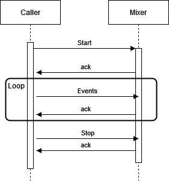

# Live audio Mixer

## Description

This project is a live audio mixer that allows the user to mix multiple audio sources in real time. The user can control the volume of each audio source and the volume of the output. The user can also mute any audio source and the output. The user can also swap audio sources.
## Usage

There are tree commands available, all of which must be called using the gRPC API:
- Start a new record with an ID
- Stop recording by ID
- Send new events to the mixer



Once a new recording is started, it will continue recording until stopped. If there is no audio, silence is used. The user can send events to the mixer to change the audio sources. The mixer will then change the audio sources and send the new audio to the output.
### Events

During recording, you can send events to the mixer to change the audio sources. Events are sent using the gRPC API. Events are sent using the following message

```protobuf
enum EventType {
  UNSPECIFIED = 0;
  PLAY = 1;
  PAUSE = 2;
  RESUME = 3;
  STOP = 4;
  SEEK = 5;
  VOLUME = 6;
  OTHER = 7;
}

message Event {
  // UUID of the record
  string recordId = 1;
    // UUID of the event
  string evtId = 2;
  // Type of event, see below
  EventType type = 3;
  // Direct URL to the resource to play
  string assetUrl = 4;
  // Whether to loop the audio when it ends
  bool loop = 5;
}
```

There are currently two types of event:
- PLAY: adds a new audio source to the mixer
- STOP: Removes an audio source from the Mixer

### Example

The following example shows how to use the mixer.
At t=0s, the user starts a new recording with ID 1. The mixer starts recording, and since there is no audio playing, it records silence.
At t=1s, the user sends a PLAY event to the mixer. The mixer adds the audio source to the mixer and starts playing it.
At t=5s, the user sends another PLAY event to the mixer with a different URL. The mixer adds the second audio source and mixes it with the first.
At t=10s, the user sends a STOP event to the mixer to stop the first track. The mixer removes the first audio source from the mixer and stops playing it. Only the second audio source is now playing.
At t=15s, the user sends a STOP event to the Mixer to stop the second track. The mixer removes the second audio source from the mixer and stops playing it. No audio is playing now.
At t=20s, the user sends a STOP event to the mixer to stop recording. The mixer stops recording and sends the audio to the output.